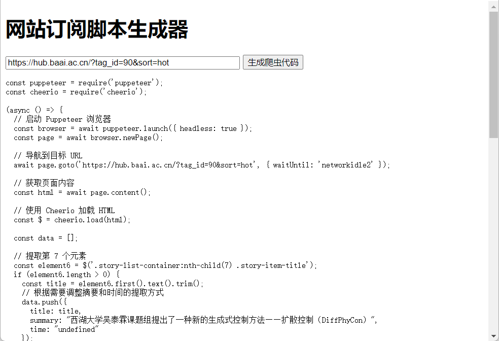

# Web Crawler Script Generator 🕸️🤖

## 简介 | Introduction

欢迎使用 **Web Crawler Script Generator**！🎉 这是一个基于 Electron 的工具，帮助用户轻松生成用于抓取特定网站信息的爬虫脚本。只需输入目标网站 URL，工具将自动分析网站结构，提取关键信息，并生成可用于 Puppeteer 的 Node.js 爬虫代码。✨

Welcome to **Web Crawler Script Generator**! 🎉 This is an Electron-based tool that helps users effortlessly generate web crawler scripts for specific websites. Simply input the target website URL, and the tool will automatically analyze the website structure, extract key information, and generate Node.js crawler code compatible with Puppeteer. ✨


## 特性 | Features ✨

- **简便易用**：用户友好的界面，输入 URL 即可生成爬虫脚本。🖥️
- **自动化分析**：使用 Puppeteer 自动加载网站，截图并提取文本内容。📄📸
- **智能处理**：集成 OpenAI 多模态接口，智能提取标题、摘要、时间等关键信息。🧠
- **精确选择器**：利用 `@medv/finder` 生成精准的 CSS 选择器，确保爬虫脚本的稳定性。🎯
- **多语言支持**：支持中英文双语界面，满足不同用户的需求。🌐

- **User-Friendly**: Easy-to-use interface that generates crawler scripts by simply inputting a URL. 🖥️
- **Automated Analysis**: Uses Puppeteer to automatically load websites, take screenshots, and extract text content. 📄📸
- **Intelligent Processing**: Integrates OpenAI's multimodal API to intelligently extract titles, summaries, dates, and other key information. 🧠
- **Precise Selectors**: Utilizes `@medv/finder` to generate accurate CSS selectors, ensuring the stability of crawler scripts. 🎯
- **Bilingual Support**: Supports both Chinese and English interfaces to cater to diverse user needs. 🌐

## 里程碑 | Milestones 🎯

### 短期目标 | Short-Term Goals 🚀

1. **优化 Electron 应用 UI** 💅🎨
   - 提升用户界面的美观性和用户体验，采用现代设计风格。
   - 增加响应式设计，确保在不同屏幕尺寸下的良好显示。

2. **支持多字段 DOM 元素爬虫** 🔍🖥️
   - 允许用户选择和配置多个字段（如标题、摘要、时间等）的抓取。
   - 提供灵活的字段映射功能，适应不同网站的结构。

3. **集成 AI 优化生成的爬虫代码步骤** 🤖💡
   - 使用 OpenAI 的模型自动优化爬虫代码逻辑，提高代码效率和稳定性。
   - 提供智能建议，帮助用户调整和改进爬虫脚本。

### 中期目标 | Mid-Term Goals 📈

4. **添加调度爬取功能** 📅🔄
   - 允许用户设置定时任务，定期自动运行爬虫脚本。
   - 支持多种调度策略，如每天、每周或按需运行。

5. **实现数据可视化和报告功能** 📊📈
   - 集成数据可视化工具，实时展示抓取的数据。
   - 生成详细的报告，帮助用户分析和理解数据。

6. **扩展与更多 Web 技术和框架的兼容性** 🌐📚
   - 支持更多的前端框架（如 React、Vue、Angular）的自动解析和爬取。
   - 提供针对动态内容和 SPA（单页应用）的优化爬取策略。

### 长期目标 | Long-Term Goals 🌟

7. **实现协作功能以支持团队项目** 👥🤝
   - 允许多用户协作，共享和管理爬虫脚本。
   - 提供权限管理，确保数据和脚本的安全性。

8. **添加插件支持，允许用户扩展功能** 🧩🔌
   - 开发插件系统，用户可以根据需求添加自定义功能。
   - 提供丰富的插件库，涵盖各种爬取和数据处理需求。

9. **集成数据库和云存储解决方案** ☁️🗄️
   - 支持将抓取的数据直接存储到各种数据库（如 MongoDB、PostgreSQL）。
   - 提供云存储集成，方便数据的备份和共享。

10. **增强安全性功能以保护用户数据** 🔒🛡️
   - 实现数据加密和安全传输，确保用户数据的隐私性。
   - 提供安全审计和日志记录功能，监控和防范潜在的安全威胁。

11. **引入机器学习优化爬虫策略** 📚🤖
   - 使用机器学习算法分析和优化爬虫的抓取策略，提高效率和准确性。
   - 自动适应网站结构的变化，减少维护成本。

12. **开发移动端支持，扩展应用平台** 📱🌍
   - 设计和开发移动端应用版本，方便用户随时随地管理爬虫任务。
   - 保持与桌面版本的功能一致性和数据同步。

### 未来展望 | Future Prospects 🌠

- **全球化扩展** 🌏✨
   - 支持更多语言，满足全球用户的需求。
   - 拓展国际市场，建立多语言社区。

- **社区驱动的发展** 🏘️🌱
   - 建立活跃的开发者和用户社区，促进知识分享和合作。
   - 定期举办黑客松和贡献活动，激励更多人参与项目发展。

- **持续创新与优化** 💡🔧
   - 不断跟踪最新的技术趋势，集成先进的工具和技术。
   - 持续优化性能和用户体验，保持项目的竞争力。


## 安装 | Installation 🚀

### 前提条件 | Prerequisites

- [Node.js](https://nodejs.org/) >= 18.x

### 步骤 | Steps

1. **克隆仓库 | Clone the repository**

   ```bash
   git clone https://github.com/MaskerPRC/auto-vl-spider.git
   cd your-repo
   ```

2. **安装依赖 | Install dependencies**

   ```bash
   npm install
   ```

3. **打包 `@medv/finder` | Bundle `@medv/finder`**

   ```bash
   npx webpack --config webpack.config.js
   ```

4. **启动应用 | Start the application**

   ```bash
   npm start
   ```

## 使用 | Usage 🛠️

1. **启动应用后**，在界面中输入您想要订阅的网站 URL。🌐

2. **点击“生成爬虫代码”按钮**，工具将自动分析网站并生成相应的爬虫脚本。📝

3. **查看并复制生成的代码**，您可以将其用于您的项目中。📋

### 示例 | Examples



*输入 URL 并生成爬虫代码的界面示例*

## 示例 | Examples 📂

以下是生成的爬虫代码示例：

```javascript
const puppeteer = require('puppeteer');
const cheerio = require('cheerio');

(async () => {
    // 启动 Puppeteer 浏览器
    const browser = await puppeteer.launch({ headless: true });
    const page = await browser.newPage();

    // 导航到目标 URL
    await page.goto('https://hub.baai.ac.cn/?tag_id=90&sort=hot', { waitUntil: 'networkidle2' });

    // 获取页面内容
    const html = await page.content();

    // 使用 Cheerio 加载 HTML
    const $ = cheerio.load(html);

    const data = [];

    // 提取第 7 个元素
    const element6 = $('.story-list-container:nth-child(7) .story-item-title');
    if (element6.length > 0) {
        const title = element6.first().text().trim();
        // 根据需要调整摘要和时间的提取方式
        data.push({
            title: title,
            summary: "西湖大学吴泰霖课题组提出了一种新的生成式控制方法——扩散控制（DiffPhyCon）",
            time: "undefined"
        });
    }

    // 提取第 8 个元素
    const element7 = $('.story-list-container:nth-child(8) .story-item-title');
    if (element7.length > 0) {
        const title = element7.first().text().trim();
        // 根据需要调整摘要和时间的提取方式
        data.push({
            title: title,
            summary: "该研究探讨了复杂生态系统中微生物群落的多稳定性现象",
            time: "undefined"
        });
    }

    // 提取第 9 个元素
    const element8 = $('.story-list-container:nth-child(9) .story-item-title');
    if (element8.length > 0) {
        const title = element8.first().text().trim();
        // 根据需要调整摘要和时间的提取方式
        data.push({
            title: title,
            summary: "上周日，果壳儿参加了奇绩创坛2024年秋季创业营路演日",
            time: "undefined"
        });
    }

    // 提取第 11 个元素
    const element10 = $('.story-list-container:nth-child(11) .story-item-title');
    if (element10.length > 0) {
        const title = element10.first().text().trim();
        // 根据需要调整摘要和时间的提取方式
        data.push({
            title: title,
            summary: "清华大学交叉信息研究院濮云飞和段路明研究组在冷原子系统中实现12公里光纤长度上多模式增强的预报式原子",
            time: "undefined"
        });
    }

    // 提取第 12 个元素
    const element11 = $('.story-list-container:nth-child(12) .story-item-title');
    if (element11.length > 0) {
        const title = element11.first().text().trim();
        // 根据需要调整摘要和时间的提取方式
        data.push({
            title: title,
            summary: "OpenAI 发布了季首直播，主要介绍了两项更新：o1 完全体和 ChatGPT Pro",
            time: "undefined"
        });
    }

    // 输出提取的数据
    console.log(data);

    // 关闭浏览器
    await browser.close();
})();
```

## 贡献 | Contributing 🤝

非常欢迎您的贡献！🎉 请遵循以下步骤来贡献您的代码：

1. **Fork 本仓库 | Fork the repository**
2. **创建新分支 | Create a new branch**

   ```bash
   git checkout -b feature/YourFeature
   ```

3. **提交更改 | Commit your changes**

   ```bash
   git commit -m "Add some feature"
   ```

4. **推送到分支 | Push to the branch**

   ```bash
   git push origin feature/YourFeature
   ```

5. **创建 Pull Request**，我们将尽快审核您的贡献。🚀

### 贡献指南 | Contribution Guidelines 📜

- **代码风格 | Code Style**：请遵循现有的代码风格和规范。
- **文档 | Documentation**：确保文档更新与代码变更保持同步。
- **测试 | Tests**：添加相应的测试以覆盖新功能或修复的 bug。
- **报告问题 | Report Issues**：请先搜索现有问题，确保未被报告，然后详细描述您的问题或建议。

## 许可证 | License 📝

本项目使用 [MIT 许可证](./LICENSE)。欢迎自由使用、修改和分发！🔓

This project is licensed under the [MIT License](./LICENSE). You are free to use, modify, and distribute it! 🔓

## 联系我们 | Contact 📬

有任何问题或建议，欢迎通过以下方式联系我：

- **邮箱 | Email**: maskerprc@gmail.com
- **GitHub**: [maskerprc](https://github.com/maskerprc)

Feel free to reach out via the following channels:

- **Email**: maskerprc@gmail.com
- **GitHub**: [maskerprc](https://github.com/maskerprc)

## 鸣谢 | Acknowledgments 🙏

感谢以下项目和社区的支持与贡献：

- [Electron](https://www.electronjs.org/) - 桌面应用框架
- [Puppeteer](https://pptr.dev/) - Node.js 库，提供高级 API 来控制 Chromium 或 Chrome
- [@medv/finder](https://github.com/medv/finder) - 生成元素的唯一 CSS 选择器
- [OpenAI](https://openai.com/) - 提供强大的 AI 接口
- [Shields.io](https://shields.io/) - 用于生成徽章

Special thanks to the following projects and communities for their support and contributions:

- [Electron](https://www.electronjs.org/) - Desktop application framework
- [Puppeteer](https://pptr.dev/) - Node.js library providing a high-level API to control Chromium or Chrome
- [@medv/finder](https://github.com/medv/finder) - Generates unique CSS selectors for elements
- [OpenAI](https://openai.com/) - Provides powerful AI APIs
- [Shields.io](https://shields.io/) - For generating badges

## 📈 Star 历史

[](https://star-history.com/#MaskerPRC/auto-vl-spider&Date)
